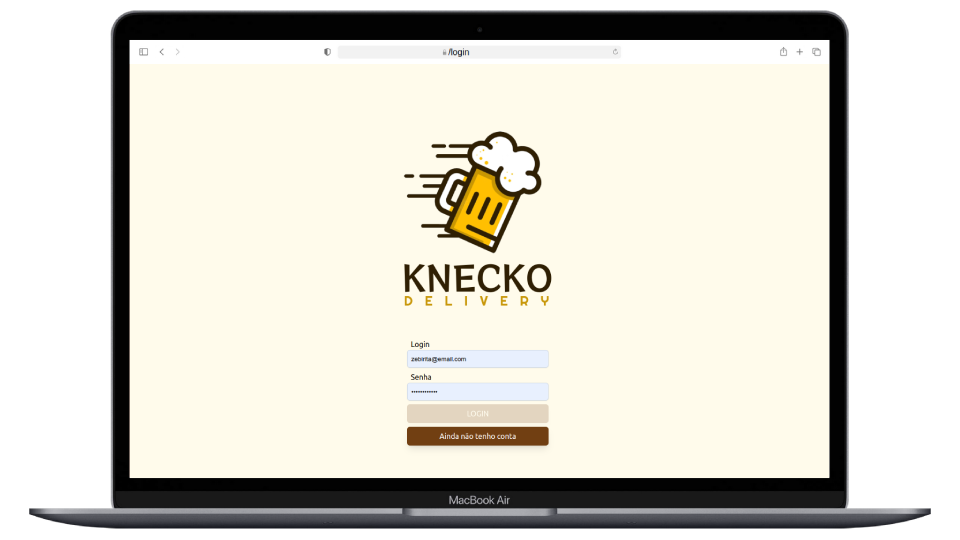

# :iphone: Delivery App :tropical_drink:

## :pencil2: About/Sobre

  
<strong>:us: English</strong>
 

Full stack React/Node.js group project developed by [Rodrigo Camargo](https://www.linkedin.com/in/rodrigocamargobr/) at the end of Section 13 ([Back-end Development Module](https://github.com/rodcamargo/trybe-exercicios)) from the Trybe Web Development course. Approved with 100% of requirements met.

We had to develop both the Front-end and Back-end of a full stack application for a drink delivery app by using React, Node,js and Express.
 

  
<strong>:brazil: Português</strong>
 

Projeto full stack React/Node.js desenvolvido por [Rodrigo Camargo](https://www.linkedin.com/in/rodrigocamargobr/) ao final da Seção 13 ([Módulo Desenvolvimento Back-end](https://github.com/rodcamargo/trybe-exercicios)) do curso de Desenvolvimento Web da Trybe. Aprovado com 100% dos requisitos atingidos.

Com o objetivo de desenvolver o Front-end/Back-end de uma aplicação FullStack de um aplicativo de delivery de bebidas. O front-end foi desenvolvido em React, enquanto o Back-end utilizamos Node.js, Express.js e Sequelize.js.
 

## :man_technologist: Developed Skills/Habilidades Desenvolvidas

  
<strong>:us: English</strong>
 

* Coworking in group using agile methodologies
* Develop a Front-end application with React
* Create an Express.js application
* Create a RESTful API using MSC (Model-Service-Controller) architecture
* Implement authentication with Json Web Token (JWT)
* Use the Sequelize.js ORM to connect with the database and perform queries
 

  
<strong>:brazil: Português</strong>
 

* Trabalho colaborativo em grupo utilizando metodologias ágeis
* Criar uma aplicação Front-end utilizando React
* Criar uma aplicação Express.js
* Criar uma API RESTful usando arquitetura MSC (Model-Service-Controller)
* Implementar autenticação por Json Web Token (JWT)
* Utilizar ORM Sequelize.js para fazer a conexão com o banco de dados
 

## :hammer_and_wrench: Tools/Ferramentas

* Javascript / React
* Tailwind CSS
* Node.js
* Express.js
* Sequelize.js
* Json Web Tokens (JWT)
* Docker
* MySQL

## :trophy: Grade/Nota

© Desenvolvido por [Rodrigo Camargo](https://www.linkedin.com/in/rodrigocamargobr/)) 
